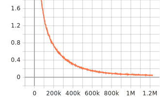

# An implementation of Transformer🤖 from the scratch

This project implements the Transformer architecture from the scratch as well as applies the Transformer to the machine translation. The project aims to construct the Transformer in a straightforward way to help me better understand how the Transformer works. I found that learning AI architecture from the paper doesn't really help me to fully understand the paper's idea. There is always something trivial but important behind the idea but never detailed in the paper, which makes me feel there is a huge gap between the paper and the practice🤨. So I create this repo to help me understand the Transformer and its variants, also hope this repo can help someone who is suffering from the Transformer.🤗

## Dataset 📁

This project uses the [Chinese-English parallel corpus](http://www.statmt.org/wmt18) from [WMT'18](http://www.statmt.org/wmt18/) as the training dataset. The dataset is preprocessed by `preprocessing.py` and the preprocessed dataset is stored in the `data` folder. The preprocessed dataset contains the following files:

- data/data_char.json: Chinese & English character-level dataset
- data/zh_dict.json: Chinese character-level dictionary
- data/en_dict.json: English word-level dictionary

The English data is always tokenized in the word-level, no matter the Chinese data is tokenized in the character-level or word-level. The Chinese data is tokenized in the character-level by default, but you can also tokenize it in the word-level by setting the `--token_level` argument to `word` in `preprocessing.py`.

## Model 🤖

The Transformer model is implemented in `model/`. The model is composed of the following components:

- `embeddings.py`: Embedding layer
- `attentions.py`: Multi-head attention and self-attention
- `decoders.py`: Decoder
- `encoders.py`: Encoder
- `transformer.py`: Transformer

## Quickstart 🚀
### Train
train on a single GPU machine
```bash
./run_single.sh
```

parallel train on multi-GPUs 
```bash
./prepare.sh
./run.sh
```

parallel train on multi-GPUs by Slurm
```bash
./prepare.sh
./run_slurm.sh
```

### loss
Here is the loss of training the Transformer on 4 * 16GB GPUs. The fluctuation at 800k steps is caused by the training on a checkpoint. Obviously, the model is currently underfitting because of the limited GPU time.😂 I will add the evaluation step in the future to check if the model is overfitting or underfitting.



### Inference
```bash
$ python inference.py 
loading model...
model loaded.
input:    人工智能并不能帮我们解决所有的问题
output:    ai does not help us solve all problems in our bodies
input:    人工智能解决一些问题    
output:    ai will solve some problems
input:    人工只能解决一些问题
output:    workers only do something about it
input:    exit
```

## Todo list 📝
- [x] Transformer
- [x] checkpointer
- [x] distributed training
- [ ] beam search
- [ ] prefix beam search
- [ ] evaluate step
- [ ] test step
- [ ] yaml config
- [ ] perplexity

----
## Reference 📚
- [Attention Is All You Need](https://arxiv.org/abs/1706.03762)